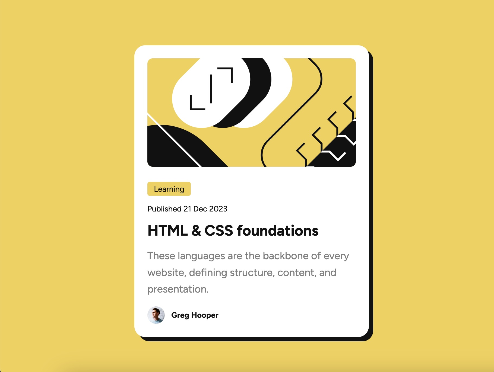

# Frontend Mentor - Blog preview card solution

This is a solution to the [Blog preview card challenge on Frontend Mentor](https://www.frontendmentor.io/challenges/blog-preview-card-ckPaj01IcS). Frontend Mentor challenges help you improve your coding skills by building realistic projects. 

## Table of contents

- [Overview](#overview)
  - [The challenge](#the-challenge)
  - [Screenshot](#screenshot)
  - [Links](#links)
- [My process](#my-process)
  - [Built with](#built-with)
  - [What I learned](#what-i-learned)
  - [Continued development](#continued-development)
  - [Useful resources](#useful-resources)
- [Author](#author)


## Overview

### The challenge

Users should be able to:

- See hover and focus states for all interactive elements on the page

### Screenshot



### Links

- Solution URL: [Add solution URL here](http://)
- Live Site URL: [https://kayy-w.github.io/Blog-Preview-Card/](https://kayy-w.github.io/Blog-Preview-Card/)

## My process

### Built with

- Semantic HTML5 markup with SCSS
- Flexbox
- No Media Queries(!)

### What I learned

The main thing I learnt during this project was how to create a responsive layout using just flexbox and resizable text. Some new SCSS I used this time round was:

```css
$Small: clamp(0.8em, 1.6vw, 1em);
$Med: clamp(1em, 2.2vw, 1.2em);
$Large: clamp(1.6em, 3vw, 1.8em);
```

Lots of fiddling to get the result I wanted and to make sure this looked right on all screen sizes. I originally tried to do this challenge with just vw font sizes but didn't have enough control so then used 'clamp' which seems to have done the job. Really pleased!

### Continued development

I want to keep building on my existing knowledge of flexbox, get better at building these layouts quicker (this took a lot of fiddling to get right) and I'd love to learn how more SCSS to create more advanced layouts.

### Useful resources

- [How to Make a Media Query-less responsive Card Component](https://css-tricks.com/how-to-make-a-media-query-less-card-component/) - I didn't use this from the beginning, I created the flexbox layout first then found this when looking for responsive font sizes. It's a good walkthrough on how to approach this type of project though!
- [A Complete Guide to Flexbox](https://css-tricks.com/snippets/css/a-guide-to-flexbox/) - This tab is permanently pinned to my Chrome browser as an essential go-to for all things flexbox.

## Author

- Website - [KayWyeth.co.uk](https://www.kaywyeth.co.uk)
- Frontend Mentor - [@ykayy-w](https://www.frontendmentor.io/profile/kayy-w)
- X/Twitter - [@kaywyeth](https://www.twitter.com/kaywyeth)